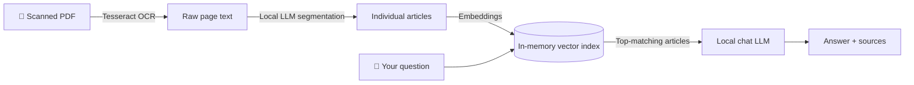

# 📰 News-to-RAG — Chat with Historical Newspapers

Turn a scanned newspaper PDF into something you can have a conversation with — running **entirely on your own machine**. No cloud APIs, no accounts, no data leaving your server.

Upload a digitized newspaper page, watch it get read and split into individual articles, then ask questions like *"What were the main stories?"* or *"What did the governor say about the teachers?"* — with every answer citing the articles it came from.

## How it works



1. **OCR** — the PDF is rasterized and read with [Tesseract](https://github.com/tesseract-ocr/tesseract), tuned for newspaper column layouts.
2. **Article separation** — a local LLM (via [Ollama](https://ollama.com)) reads the raw OCR text and splits it into individual articles with headlines.
3. **Retrieval-augmented chat** — each article is embedded locally; your questions retrieve the most relevant articles, and a lightweight chat model answers using only those articles, showing its sources.

Everything is in-memory and per-session: close the tab, nothing is kept.

## Using the app

The interface is a single page with three steps — no instructions needed:

1. **Upload** — drag a newspaper PDF onto the page (or click *"Try the example newspaper"*, a 1926 paper from the Library of Congress, included in this repo).
2. **Process** — watch live progress as the pages are scanned, articles separated, and the chat prepared. A full page takes a few minutes; the heavy lifting is OCR and LLM inference on your hardware. If that's too slow, tick **⚡ Fast scan** before uploading — it scans at half the resolution (about 4× quicker), at the cost of possibly misreading small or faded print.
3. **Chat** — the sidebar lists every article found (click one to read its full text). Ask anything in the chat; each answer shows clickable source chips for the articles it drew from.

## Quick start

**Prerequisites**

- Python 3.11+
- System packages: `tesseract-ocr` and `poppler-utils`
  (`sudo apt install tesseract-ocr poppler-utils` on Debian/Ubuntu)
- A running [Ollama](https://ollama.com) with these models pulled:

```bash
ollama pull llama3.1:8b      # article segmentation
ollama pull phi4-mini        # chat answers (small = fast responses)
ollama pull nomic-embed-text # embeddings for retrieval
```

**Install & run**

```bash
git clone https://github.com/Pharcy/news_to_rag.git
cd news_to_rag
pip install -r requirements.txt

cd webapp
python server.py
```

Open **http://localhost:8000** and drop in a PDF.

## Configuration

Everything is set via environment variables — no code changes needed:

| Variable        | Default                  | Purpose                                          |
|-----------------|--------------------------|--------------------------------------------------|
| `OLLAMA_HOST`   | `http://localhost:11434` | Where Ollama is listening                        |
| `SEGMENT_MODEL` | `llama3.1:8b`            | Model that splits OCR text into articles         |
| `CHAT_MODEL`    | `phi4-mini:latest`       | Model that answers chat questions                |
| `EMBED_MODEL`   | `nomic-embed-text`       | Embedding model for retrieval                    |
| `TOP_K`         | `3`                      | Articles given to the chat model per question    |
| `OCR_DPI`       | `600`                    | Scan resolution for normal (high-quality) mode   |
| `FAST_OCR_DPI`  | `300`                    | Scan resolution when "Fast scan" is checked      |
| `WEBAPP_HOST`   | `0.0.0.0`                | Bind address                                     |
| `WEBAPP_PORT`   | `8000`                   | Port                                             |

Example — remote Ollama box and a bigger chat model:

```bash
OLLAMA_HOST=http://10.0.0.5:11434 CHAT_MODEL=llama3.1:8b python server.py
```

**Swapping the example PDF:** drop any `*.pdf` into `webapp/sample/` — the first one (alphabetically) becomes the *"Try the example newspaper"* button. Remove all PDFs and the button disappears.

## Project layout

```
news_to_rag/
├── OCR_LIB/                  # OCR + article-separation pipeline (also usable standalone)
│   ├── Pdf_to_json.py        #   PDF → per-page OCR text (Tesseract, 600 dpi)
│   └── article_seperate.py   #   OCR text → individual articles (via Ollama)
├── webapp/
│   ├── server.py             # FastAPI backend (upload, status polling, chat API)
│   ├── pipeline.py           # Glue: runs the OCR_LIB pipeline as background jobs
│   ├── rag.py                # Embeddings + cosine retrieval + grounded chat
│   ├── config.py             # All env-var configuration in one place
│   ├── static/               # Single-page frontend (plain HTML/CSS/JS)
│   └── sample/               # Drop the example PDF here
└── requirements.txt
```

## Notes & limitations

- **OCR quality bounds everything.** Faded or damaged scans produce noisy text; the LLM segmentation and chat both tolerate typos, but garbage in still limits answers.
- **Article segmentation is LLM-judgement.** The model may occasionally merge or split articles differently than a human would; counts vary slightly between runs.
- **This is a showcase, not a production service.** There is no authentication, no persistence, and uploads are processed one job per request — don't expose it to the open internet as-is.
- Answers are constrained to the extracted articles: the assistant is instructed to say so when the newspaper doesn't contain an answer, rather than invent one.
